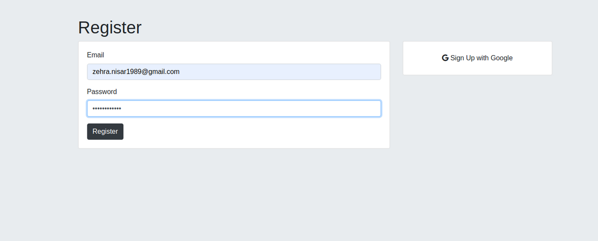

## JS Auth login
A full stack "register/login" site for users, implementing cookies and sessions with PassportJS. Users get the option to login via Google (via OAuth) or register new account locally with the site, which are stored in a MongoDB backend.

## Motivation
The idea behind this app is to learn authentication and security models for frontend websites. On registration, this application asks users to stored values (secrets) in the application. Users can get access to these secrets when they log back in.

The application was built as a part of a learning activity in bootcamp. I learned a great deal of things on how to use Passport.JS and how to parse data through MongODB.

### Tech

Frontend

- HTML
- CSS

Backend

- NodeJS
- EJS
- MongoDB

Security and Authentication

- PassportJS
- OAuth

## Screenshots

## Future Improvements

Dependabot has raised a couple of things which need to be addressed.

1. Hard coded secret: I added a hard-coded secret to test access inside the application. This secret is only available to a specific user
2. CORS error: There are some errors which popped up during the code testing relating to cross-origin-request-block

© [zyphuscode]()